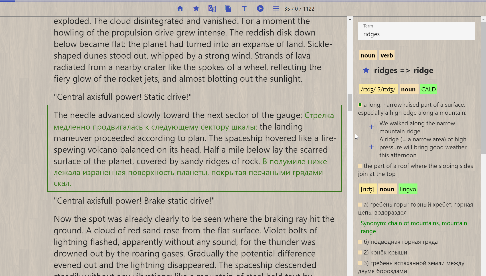
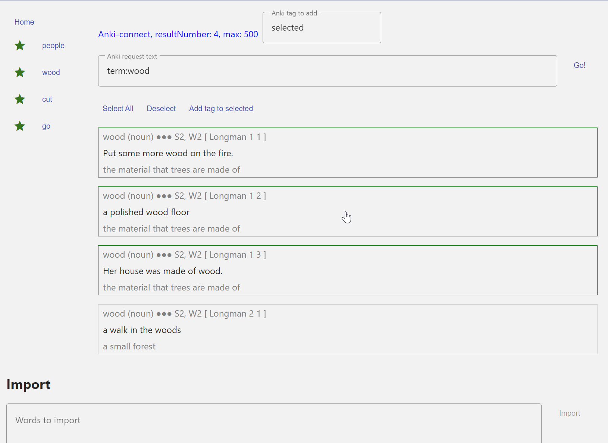
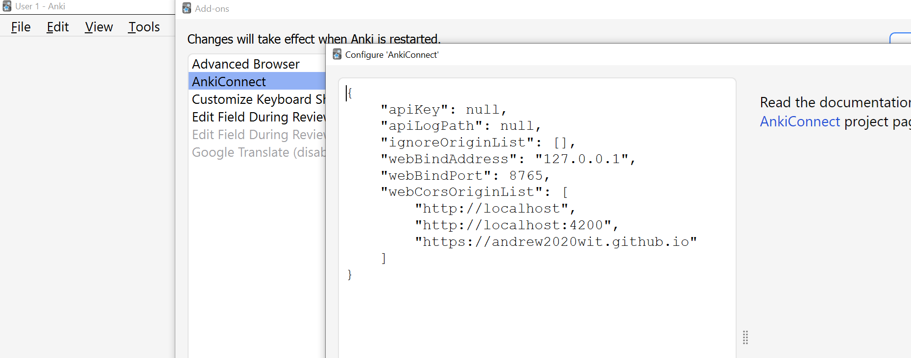
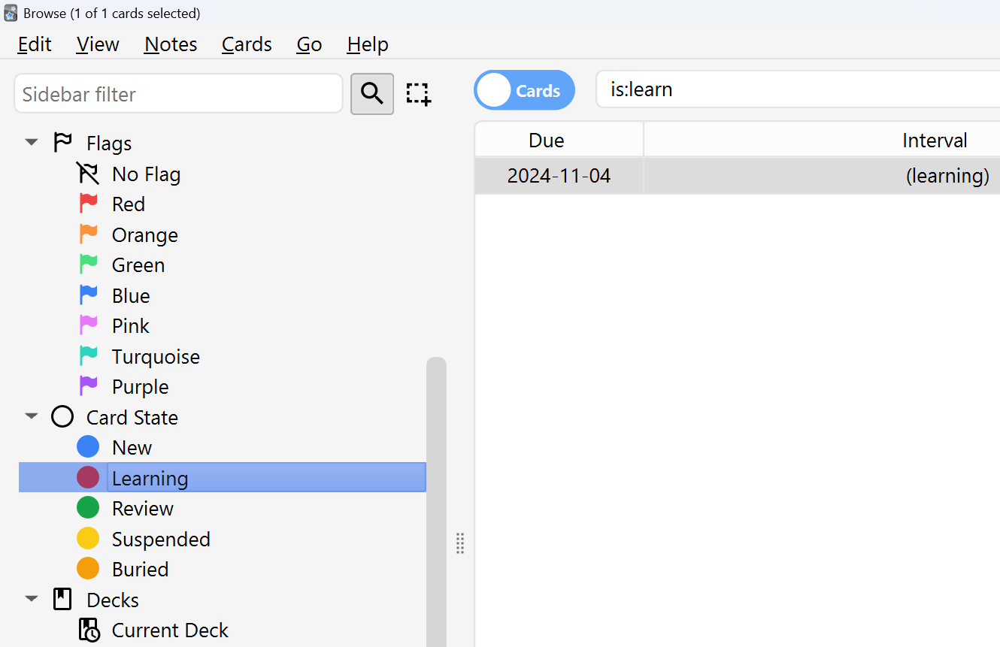

# Foreign Reader - the web-application to read foreign books and learn languages.

[https://andrew2020wit.github.io/foreign-reader/](https://andrew2020wit.github.io/foreign-reader/)

[https://youtu.be/1YP31gjr-Es](https://youtu.be/1YP31gjr-Es)

## Intro

Foreign Reader is a web-application to read foreign books (texts) and to learn foreign languages.

It's a book reader, which has built-in dictionary and translation functionality.
It also has special functionality to learn vocabulary.

It stores all data locally and uses PWA-technology, so you can use it without Internet.

It's optimized for very big books.

You don't have to pay for it, and it doesn't show advertise.

There are related projects to convert some dictionary into json-format.



## Books

You have to create your own books from txt-file, srt-file, or epub-file.

But, to try this application, you can also take books from here:

[./books](./books)

1. download the json-book
2. un-zip if it in zip-file
3. import as json-file

Some books may contain unreadable text at the beginning.
This is a result of import from epub-files.

## Functionality

You can open a plain text file (UTF-8 encoding).
This text will be converted into inner format
and stored locally in you web-browser storage (IDB-storage).

You can customize appearance (text size, colors, background and other).

It supports multiple bookmarks and automatically remembers last position.

It provides integration with translation.

It can be integrated with outer dictionary (like GoldenDict) via auto-coping to clipboard.

It has a built-in dictionary viewer, which support json-format dictionaries.
Some tools and dictionary was created to support json-format dictionaries.

It has a functionality for memory-cards like Anki-card.
You can easily create memory-cards (by one click) from dictionary-examples.

### Dictionary functionality

#### go to Settings

- Load morphology.json and morphology-replace-rules.json.
  See: [dictionary](https://github.com/andrew2020wit/foreign-reader/tree/master/dictionary)
- Load main-dictionary. See "
  wordset-with-tr.json": [dictionary](https://github.com/andrew2020wit/foreign-reader/tree/master/dictionary)
- Turn-on dictionary-functionality.

#### There are some tools to convert dsl and mdx dictionaries to json, but they are specific for the certain dictionary.

See also:

Parser for Lingvo en-ru
dsl-dictionary: [https://github.com/andrew2020wit/dsl-dictionary-parser](https://github.com/andrew2020wit/dsl-dictionary-parser)

Some utils (uniter and other) are also there.

Parser for Cambridge Advanced Learner's Dictionary 4th, mdx
format: [https://github.com/andrew2020wit/cald-mdx-to-json](https://github.com/andrew2020wit/cald-mdx-to-json)

#### Morphology Replace Rules

See about morphology-replace-rules [here](https://github.com/andrew2020wit/foreign-reader/tree/master/dictionary/utils)

You can define you own Morphology Replace Rules.

index: index for replacement ( - 1 => from end)

See example /dictionary/morphology-replace-rules.json

And see /dictionary/utils/compute-morphology-rule(.spec).ts

## Translation

You can translate your book:

- go to menu (in book) - translation tab
- export for translation - it will create a special text file
- you have to translate it with google-translate (for documents).
- import the translation (the same format).

Look at youtube-video for details.

Then you can click on lines to see translation.

## Favorite Examples are similar to Anki functionality.

Hot keys are applied only for first example (see tooltip).
'space'-key - show info.

You can export-import list - see settings.

#### See also:

create favorites-examples list from CALD dictionary:

[create-favorites-list.js](https://github.com/andrew2020wit/cald-mdx-to-json)

## SpeechEngine

To use SpeechEngine go to menu (book's page), audio-tab, and select voice.

At the moment Google voices have a bug - it doesn't support a long text,
so don't use Google voices.

On Windows I highly recommend to try Edge-browser and Microsoft **online** voices.
For example "Microsoft Andrew Online (Natural)"

## Mobile

If screen width < 1000px then it is in mobile mode.
Use double click to show pop-up dictionary.

I suggest to install it as application for mobile devices (from chrome menu). 

Use customization to adjust font-size.

## Urls-tip

You can use web-url to search %s:

https://andrew2020wit.github.io/foreign-reader/dictionary-viewer?term=framework
https://andrew2020wit.github.io/foreign-reader/dictionary-viewer?hideInput=true&hideMenu=true&term=framework

https://andrew2020wit.github.io/foreign-reader/create-example?add=%s

with (for example) [selection-search chrome-extension](https://chromewebstore.google.com/detail/selection-search/gipnlpdeieaidmmeaichnddnmjmcakoe)

(see its settings)

### Hot-keys

GoHome: 'Home', ShowMenu: '0', 'Escape', GoToNextItem: 'n', MarkIt: '1',
EditChapterTitle: '9', GoToNextMark: 'm', GoToPrevMark: 'k'.
TranslateOne - 'h'.

### About some custom styles

Custom styles are applied only to the book-page.

You can use any css-values.

Accent colors are related to headers.

Color primary/accent/warn - for buttons.

#### Background

You can use [these](https://github.com/andrew2020wit/foreign-reader/tree/master/docs/assets/background)
or other.

Like: "url(https://andrew2020wit.github.io/foreign-reader/assets/background/fancy-deboss.png)" or "none"

## Favorite words and Anki connect



See: [https://foosoft.net/projects/anki-connect/](https://foosoft.net/projects/anki-connect/)

You can create a list of favorite words. This application provide functionality to find and mark cards in Anki.

It was created to deal with a very huge anki-deck, which is made from a dictionary.

You must install anki-connect and configure it: add "https://andrew2020wit.github.io" to "webCorsOriginList".



An anki deck must contain notes with field (ignore "value" - it's an anki-entity):

```typescript
export interface ICardFields {
    def: {
        value: string;
    };
    exampleId?: {
        value: string;
    };
    exampleText: {
        value: string;
    };
    freq?: {
        value: string;
    };
    freq2?: {
        value: string;
    };
    term: {
        value: string;
    };
    pos: {
        value: string;
    };
    sensenum?: {
        value: string;
    };
}
```

### ExternalId

if "externalId" is "on" (the settings), and the example (from a dictionary) has field "externalId",
then, instead to add the example to favorite examples,
(from dictionary widget) it connects to Anki,
find the card with this id ("id"-field of an anki note), and:

1. forget this card
2. answer this card with "ease: 1" (learn again)

You can immediately find it in "learning card state". You will see this card after some time.



See also: "Dictionary to Anki" - You can convert the json-dictionary to an anki text file (to import in Anki).
It also creates the copy of the json-dictionary with "externalId", which you can use
with Foreign Reader.

[https://github.com/andrew2020wit/json-dictionary-utils](https://github.com/andrew2020wit/json-dictionary-utils)

## Related projects

### Convert epub-files to json files for Foreign Reader with bing-translate (auto translate)

[https://github.com/andrew2020wit/epub-to-json-for-fr](https://github.com/andrew2020wit/epub-to-json-for-fr)

### Convert srt-files (subtitles) to json-book (Foreign Reader)

[https://github.com/andrew2020wit/srt-to-json-book](https://github.com/andrew2020wit/srt-to-json-book)

### Parser for Lingvo en-ru (dsl-dictionary) and other scripts

1. Convert a dsl dictionary to json
2. create morphology.json
3. create the json wordset dictionary
4. add transcription to a json-dictionary from other json-dictionary

dsl-dictionary: [https://github.com/andrew2020wit/dsl-dictionary-parser](https://github.com/andrew2020wit/dsl-dictionary-parser)

### Parser for Cambridge Advanced Learner's Dictionary 4th, (mdx format)

Convert mdx dictionary to json format.

additional scripts: 

1. create favorites-examples list for 'Foreign Reader'.
2. favorite-list-to-csv.js

[https://github.com/andrew2020wit/cald-mdx-to-json](https://github.com/andrew2020wit/cald-mdx-to-json)

### JSON-dictionary utils

1. You can use it to unite several json dictionaries.
2. You can convert the json-dictionary to an anki text file (to import in Anki).
   It also creates the copy of the json-dictionary with "externalId",
   which you can use with Foreign Reader.

[https://github.com/andrew2020wit/json-dictionary-utils](https://github.com/andrew2020wit/json-dictionary-utils)

## Foreign Reader Synchronization Server (concept)

[https://github.com/andrew2020wit/foreign-reader-synchronization-server](https://github.com/andrew2020wit/foreign-reader-synchronization-server)

## Changelog

[Changelog](https://github.com/andrew2020wit/foreign-reader/blob/master/changelog.md)

## The difference from  "Bilingua Dealer"

This is a new version of [Bilingua Dealer](https://github.com/andrew2020wit/bilingua-dealer)

New approach to show translation (from two columns to one text).

The translated text is within the original text (the same paragraph).

Changed book json format.

The simpler way to create translation.

Removed useless functionality: fragments, creating bilingua, subtitle-imports.

New improvements.

## Licence

- The author of this application is Andrii Faurash.
- You can use it only for personal non-commercial purposes.
- Don't include it (or part of it) in any other application/library/product/service.
- Don't share modified copies.
- You can use it without paying accordingly to this Licence.
- This application is provided "AS IS".
- The author of this application doesn't provide any guarantees.

Copyright (c) 2023-2024 Andrii Faurash